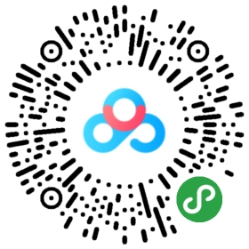
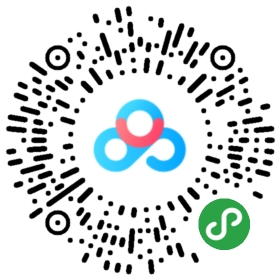

# 第四次考核

> 新学期新气象，我们的全新考核工作也继续开始啦~

## 要求

- **按照教程完成坦克大战游戏**
- **时间**：**2.11 - 2.25**
- **注意**：这次考核是一个关键考核需要在指定的时间截止日期之前完成，如果没有按时完成考核则算不通过，请认真对待。
- 考核的成绩，按照游戏的**完成度**，以及**创意度**打分并作为最终考核的参考。
- 完成后向 [云梦泽 - 任务仓库](https://github.com/yunmengzestudio/2019-Autumn) 提交 PR，内容如下：
  - 在 `Task4` 目录下创建一个名为 `姓名_task_04.md` 的 `Markdown` 文档。
  - 在此文档中简要总结这次的考核内容，附上自己这次坦克大战项目的仓库链接。
  - 提交至个人仓库，然后向任务仓库发起 PR。

## 资料

- **坦克大战**教程资料链接：[https://pan.baidu.com/s/1bEhAnv1ktClvVjofc5k1Cw](https://pan.baidu.com/s/1bEhAnv1ktClvVjofc5k1Cw) 
  提取码：`urxw`
  
  

- **Siki 视频教程**链接：https://pan.baidu.com/s/13vq2ZlwJ_eXHjIgPQmAb0g 
  提取码：`m7fq`

  

